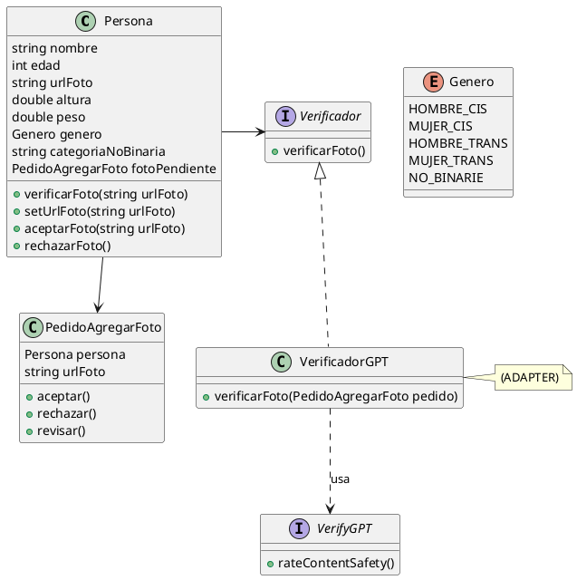
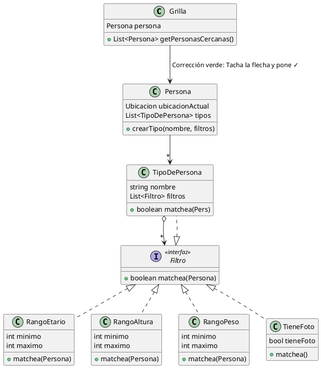
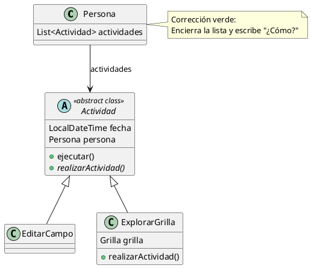
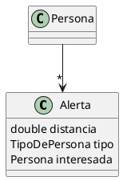

### UML: Diagramas de Clases

Aquí tienes la representación del diseño planteado por el alumno, incluyendo el patrón Adapter.



### 📝 Notas y Anotaciones (Sección 1)

**Notas del alumno:**

- _"Como el género se utilizará solamente para filtros y no existe comportamiento alguno, decido modelarlo como ENUM para mayor simplicidad."_
    
- _"En caso de que la persona decida tener una foto, se agregará por un setter debido a la lógica que conlleva agregar una foto."_
    

**Corrección del profesor (en verde):**

- Señala la nota de la foto e indica: _"Ok, pero / esto es parte del CORE"_ (texto parcialmente ilegible, parece decir _"creí género"_ o _"del negocio"_).
    

### 💻 Pseudocódigo y Correcciones (Secciones 2 y 3)

#### Clase `Persona` (Parte 1)


```java
# Persona
void verificarFoto(string urlFoto) {
    // Corrección del profesor (verde) apuntando a 'verificador': "¿dónde se declara?"
    verificador.verificarFoto(new PedidoAgregarFoto(this, urlFoto)) 
    // Corrección del profesor: Tilde verde (✓) indicando que la creación del pedido está bien.
}

void setUrlFoto(string...) { 
    // setter de urlFoto 
}
```

#### Patrón Adapter - Clase `VerificadorGPT`


```java
# VerificadorGPT
void verificarFoto(PedidoAgregarFoto pedido) {
    prob = verifyGPT.rateContentSafety(pedido.getUrlFoto())
    if (prob > 0.7)
        pedido.aceptar()
    else if (0.3 <= prob <= 0.7)
        pedido.revisar()
    else
        pedido.rechazar()
}
// Corrección del profesor (verde): Tilde (✓) sobre los if/else y texto que parece decir "Ok! De la forma expuesta..."
```

#### Clase `PedidoAgregarFoto`


```java
# PedidoAgregarFoto
// Corrección del profesor (verde) apuntando a la clase: "¿qué se hace con esto?"

aceptar() {
    persona.aceptarFoto(urlFoto)
}

rechazar() {
    persona.rechazarFoto()
}

revisar() {
    persona.agregarPedidoFoto(this)
}
```

#### Clase `Persona` (Parte 2 - Lógica de aceptación/rechazo)


```java
# Persona
PedidoAgregarFoto fotoPendiente;

aceptarFoto(string urlFoto) {
    this.setUrlFoto(urlFoto);
    fotoPendiente = null;
    
    // Corrección del profesor (verde): El profesor encierra/tacha la palabra "new" y escribe "es una interfaz"
    new Notificador.enviarNotificacion(this, "Aprobamos tu foto") 
}

rechazarFoto() { 
    fotoPendiente = null;
    
    // Corrección del profesor (verde): El profesor vuelve a tachar/marcar con una 'X' la palabra "new"
    new Notificador.enviarNot(this, "Rechazamos tu foto")
}
```


### 📝 Sección 4: Lógica de Notificaciones

**Texto del alumno:**

"4. En los métodos `aceptarFoto()` y `rechazarFoto()` se notifica a la persona. Estos mensajes son enviados a la persona a través de `VerificadorGPT` o de una persona que revise un `PedidoAgregarFoto` en Persona y decide aceptar o rechazar el pedido."

**Corrección del profesor (en verde):**

- El profesor tacha/subraya la última parte ("decide aceptar o rechazar el pedido") y anota una marca de verificación (✓) junto con un comentario que parece decir: _"¿Cuándo se invoca?"_ o _"¿Quién lo invoca?"_.
    

### UML: Sección 5 (Cercanía) y Secciones 6-7 (Filtros y Composite)

Aquí tienes la representación en PlantUML de los dos diagramas diagramados en la hoja.

Fragmento de código



### 💻 Pseudocódigo y Correcciones (Secciones 5, 6, 7 y 8)

#### Sección 5: Personas Cercanas

```java
# Grilla
List<Persona> getPersonasCercanas() {
    return RepoPersonas
        .todas()
        .sort(p -> p.distanciaCon(this.persona.getUbicacionActual()))
        .take(100);
}
// Corrección del profesor: Tilde (✓)

# Persona
double distanciaCon(Ubicacion ubicacion) {
    return ubicacionActual.distanciaA(ubicacion);
}
// Corrección del profesor: Tilde (✓)
```

#### Sección 6: Filtros (Patrón Strategy)

**Nota del alumno:**

_"Cada clase que implementa Filtro tendra en matchea la lógica para decir si una persona cumple o no, con el filtro. Esta solución es EXTENSIBLE ya que si se agregan más atributos a una persona, es muy fácil agregar nuevos filtros."_

**Corrección del profesor (en verde):**

- Agrega un tilde (✓) y escribe: _"¿ejemplo de implementación?"_.
    

```java
# Grilla
List<Persona> filtrar(List<Filtro> filtros) {
    return this.getPersonasCercanas()
               .filter(p -> filtros.all(f -> f.matchea(p)));
}
// Corrección del profesor: Tilde (✓)
```

#### Sección 7 y 8: Tipos de Persona (Patrón Composite)

**Correcciones del profesor (en verde) sobre el diagrama de la Sección 7:**

- Apuntando a la relación entre `TipoDePersona` y la interfaz `Filtro`: _"¿Cómo se implementa?"_ con un tilde (✓).
    
- Apuntando al método `crearTipo(nombre, filtros)` dentro de `Persona`: _"¿qué hace? agregaciones?"_
    

**Texto del alumno (Sección 8):**

_"8. Al aplicar composite, permite que un `TipoDePersona` pueda incluirse en (`#Grilla >> filtrar(filtros)`) por implementar la interfaz Filtro."_

**Corrección del profesor (en verde):**

- Agrega un tilde (✓).


### UML: Sección 10 (Actividades)

Aquí tienes la representación en PlantUML del diagrama de clases planteado en la sección 10 para el registro de actividades.

Fragmento de código



### 💻 Pseudocódigo y Correcciones (Secciones 9 y 11)

#### Sección 9: Estado de conexión

```java
# Persona
boolean estaConectada() {
    return this.estadoDeConexion;
}
```

#### Sección 11: Actualización de Ubicación

```java
# Persona >> actualizarUbicacionActual() {
    this.ubicacionActual = Localizador.localizar(this);
}
// Corrección del profesor (verde): Tilde (✓) y añade una nota: 
// "Pero podría estar resguardado por un if para advertir sobre errores"

# RepoPersonas >> actualizarUbicaciones() {
    this.todas()
        .forEach(p -> p.actualizarUbicacionActual());
}
// Corrección del profesor (verde): Tilde (✓)
```

**Nota del alumno:**

_"PUNTO DE ENTRADA EN UN MAIN, QUE MEDIANTE UN PLANIFICADOR EXTERNO como crontab SE EJECUTA CADA 5 MINUTOS."_

**Corrección del profesor (en verde):**

- Tilde (✓) y añade el comentario: _"(más detalle)"_.
    

### 📝 Notas y Pseudocódigo (Sección 10 - Actividades y Conexión)

**Texto del alumno:**

_"En cada método que signifique una acción de la persona, se agregará una Actividad a la persona. De esta manera se podría verificar la fecha de la última actividad."_

**Corrección del profesor (en verde):**

- Encierra la frase "se agregará una" apuntando a la clase `Actividad` y escribe: _"¿Qué patrón?"_ (parece referirse al patrón Command o Template Method).
    

#### Pseudocódigo de Actividad

```java
# Actividad >> ejecutar() {
    persona.actualizarUbicacionActual();
    persona.conectar();
    this.realizarActividad();
}
// Corrección del profesor (verde): Tilde (✓) y pregunta "¿Qué patrón es?" (apunta al uso de Template Method).

# Persona >> conectar() {
    this.estadoDeConexion = true;
}
// Corrección del profesor (verde): Tilde (✓).

# RepoPersonas >> actualizarConexiones() {
    this.todas().forEach(p -> p.actualizarConexion())
}
```

**Nota del alumno (lado inferior derecho):**

_"`actualizarConexion()` en `Persona` chequea si la última actividad fue hace más de 10 minutos, entonces `this.estadoDeConexion = false;`"_

**Nota del alumno (sobre la actualización general):**

_"IDEM PUNTO 11 PERO CADA 10 MINUTOS"_

### 👨‍🏫 Comentario final del profesor (Parte inferior en verde)

El profesor deja una extensa nota al final de la página evaluando la propuesta de la sección 10:

> _"La idea es correcta pero falta un ej[emplo] de uso. Algo como:_
> 
> `new ExplorarGrilla(persona, ...).ejecutar()`
> 
> _(Nota adicional, parcialmente ilegible, parece decir): De los tiempos, no se entiende esto."_


### UML: Sección 12 (Alertas)

Aquí tienes la representación en PlantUML del diagrama de clases planteado en la sección 12 para el sistema de alertas.



**Corrección del profesor (en verde):**

* El profesor encierra en un círculo el atributo `Persona interesada` dentro de la clase `Alerta`, traza una flecha y anota: *"¿por q / es / necesaria?"* (¿Por qué es necesaria?).

---

### 💻 Pseudocódigo y Correcciones (Sección 13 - Lógica de Alertas)

#### Conexión de la Persona

```java
# Persona >> conectar() {
    this.estadoDeConexion = true;
    RepoAlertas.activarAlertas(this);
}

```

#### Repositorio de Alertas

```java
# RepoAlertas >> activarAlertas(Persona recienConectada) {
    this.todas().filter(a -> a.activadaPor(recienConectada))
                .forEach(a -> a.notificar());
}

```

#### Clase Alerta (Lógica de activación)

```java
# Alerta >> boolean activadaPor(Persona recienConectada) {
    // compara distancias y si tipo.matchea(recienConectada)
    // entre ubicaciones actuales
}
// Corrección del profesor (verde): Tilde (✓)

```

#### Clase Alerta (Notificación)

```java
# Alerta >> notificar() {
    new notificador(interesada, "Alerta: ...");
}
// Corrección del profesor (verde): Tilde (✓)

```


