# Findr

Explota el verano boreal y nuestra clientela norteamericana de Lighter.com nos ha encargado una nueva app que revolucionará la forma en la que las personas se conocen y se enamoran.

## Perfiles

Cada persona usuaria podrá cargar un perfil en Findr, el cual contará con una serie de atributos, todos opcionales: nombre para mostrar, una edad¹, una foto (de la cual se conoce su URL), altura, peso y género.
Los géneros soportados serán hombre cis, mujer cis, hombre trans, mujer trans, y no binarie. En este último caso, se deberá permitir a las personas usuarias ingresar una descripción libre sobre qué categoría del espectro no binario lo identifica (por ejemplo: “género fluido”).

## Fotos

Debido a las políticas de contenido de las tiendas de aplicaciones, la foto de perfil debe respetar ciertas normas. Para validar esto, se utilizará un sistema externo que por medio de Inteligencia Artificial es capaz de informar la probabilidad de que la foto se ajuste a dichas normas.
Dependiendo de este porcentaje, se aceptará o rechazará la foto; o deberá ésta ser revisada por una persona moderadora cuando sea dudosa. Si la foto tiene arriba de 70% de probabilidades de ser admisible, es aceptada automáticamente. Si tiene menos de 30%, se la rechaza. Finalmente, aquellas que estén en la franja del 30-70%, deberán ser manualmente aceptadas o rechazadas por una persona moderadora.
Si una foto es rechazada, se notificará a la persona usuaria usando un componente notificador, **propio de nuestro sistema** que ya fue creado con anterioridad.

Las interfaces del sistema externo y el componente notificador son, respectivamente:

```plantuml
@startuml
hide circle
skinparam classAttributeIconSize 0

interface "VerifyGPT" as VerifyGPT <<interface>> {
  double rateContentSafety(String contentURL)
}

interface "Notificador" as Notificador <<interface>> {
  enviarNotificacion(Usuario, user, String mensaje)
}
@enduml
````

## Grilla

En la pantalla principal de Findr, se presenta una grilla con los perfiles cercanos al propio, ordenados según distancia. Para esto se cuenta con un componente **también creado con anterioridad por nuestro equipo** que nos permite conocer la ubicación de un perfil en un momento dado:

Fragmento de código

```plantuml
@startuml
hide circle
skinparam classAttributeIconSize 0

interface "Localizador" as Localizador <<interface>> {
  Ubicacion localizar(Usuario usuario)
}

class "Ubicacion" as Ubicacion {
  double latitud;
  double longitud;
  boolean distanciaA(Ubicacion otra)
}

Localizador .right.> Ubicacion
@enduml
```

La ubicación de cada perfil también se actualizará cada vez que la persona realiza alguna actividad sobre la app (editar su perfil, explorar la grilla, etc.), o a más tardar a los 5 minutos de la última actualización, lo que ocurra primero. Además, las personas usuarias podrán filtrar quiénes aparecen en esta grilla mediante filtros. Los filtros posibles son: género (hombre/mujer/no binario - no se permitirá diferenciar entre cis y trans), rango etario, rango de altura y peso, ausencia o presencia de foto y estado (conectado o inactivo).

¹ Si bien la edad es opcional, los términos y condiciones obligarán a que las personas usuarias sean adultas

## Mi tipo

Aparte de los filtros comunes, quien tiene un perfil puede crear *tipos* de persona que le gustan. Por ejemplo, alguien puede crear un *tipo* *“Hombres altos”* para hombres de más de 1,80 de altura y otro *tipo* *"Personas más jóvenes que yo”*, para personas de menos de 30 años. Un tipo se define por uno o más filtros. Al explorar la grilla, sobre los perfiles que queden filtrados, se podrá seleccionar un conjunto de *Mis Tipos* y mostrar solo aquellos que *matcheen* (encajen) con *alguno* de estos tipos seleccionados para esa búsqueda.

## Estado de conexión

En Findr los perfiles pueden aparecer como conectados o inactivos. Esto sirve para indicarle a otras personas usuarias que los mismos están usando la aplicación en el momento. Cada vez que una persona usuaria realiza una actividad (editar su perfil, explorar la grilla, etc.) se lo considera como ‘conectado’. Si alguien pasa más de 10 minutos sin realizar ninguna acción, se le considera ‘inactivo’.

## Alertas 

Finalmente, es posible configurar Alertas para distintos *Tipos*. Si se configuró una alerta para un determinado Tipo, se deberá recibir una notificación cada vez que se conecte un perfil que matchee con ese tipo, a una distancia configurable por alerta, siempre menor a 3km. 

## Requerimientos detallados

1. Como persona usuaria de Findr, deseo poder crear mi perfil con mi edad, foto, altura, peso y género.  
2. Como stakeholder de Findr, deseo que las fotos de los perfiles sean automáticamente aceptadas o rechazadas, cuando sea posible.  
3. Como persona moderadora de Findr, deseo poder aceptar o rechazar manualmente las fotos que no pudieron ser moderadas automáticamente  
4. Como persona usuaria de Findr, deseo recibir una notificación cada vez que mi foto es aceptada o rechazada  
5. Como persona usuaria, deseo poder ver en la grilla los 100 perfiles más cercanos a mí.  
6. Como persona usuaria, deseo poder filtrar los perfiles de la grilla según género, rango etario, rango de altura, rango de peso, ausencia o presencia de foto y estado de conexión de los mismos.  
7. Como persona usuaria deseo poder crear *Mis Tipos* que representen conjuntos de características deseables en otros perfiles.  
8. Como persona usuaria, deseo poder incluir *Mis Tipos* como criterios de filtrado en la grilla.    
9. Como persona usuaria, deseo saber si otro perfil está conectado o no, según la última vez que hayan utilizado la aplicación.  
10. Como persona usuaria deseo que mi ubicación y estado de conexión se actualicen cada vez que realizo una actividad en la aplicación (explorar la grilla, editar algún campo del perfil, crear un *Tipo*, etc.)[^2]  
11. Como persona usuaria deseo que mi ubicación nunca esté más de 5 minutos sin actualizar.  
12. Como persona usuaria deseo poder crear Alertas de Tipos especificando ante cuál de Mis Tipos debo ser alertada y una distancia máxima.  
13. Como persona usuaria deseo que si se conecta un perfil que encaja con el tipo de alguna de mis alertas, a una distancia más cercana que la especificada por el alerta, el sistema me notifique.

[^1]:  Si bien la edad es opcional, los términos y condiciones obligarán a que las personas usuarias sean adultas

[^2]:   Las actividades son acciones disparadas por la persona usuaria al utilizar la app, no internas del sistema. Ej: la aprobación de una foto no es una actividad y no actualiza el estado
