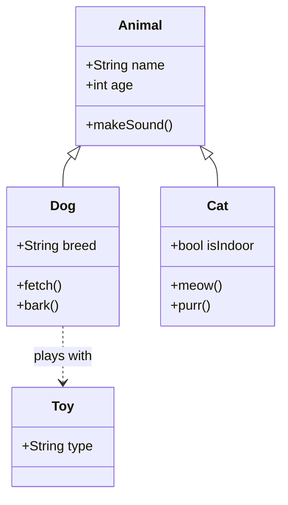
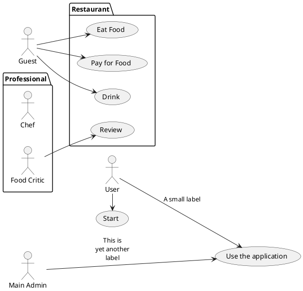

caso de uso plantUML:
```plantuml
left to right direction
skinparam packageStyle rectangle
actor customer
actor clerk
rectangle checkout_ {
  customer -- (checkout)
  (checkout) .> (payment) : include
  (help) .> (checkout) : extends
  (checkout) -- clerk
}
```


diagrama de clases mermaid ejemplo

casos de uso en plantUML ejemplo



