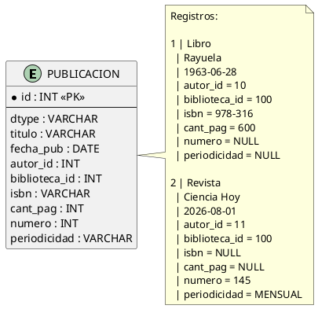
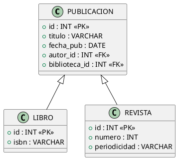
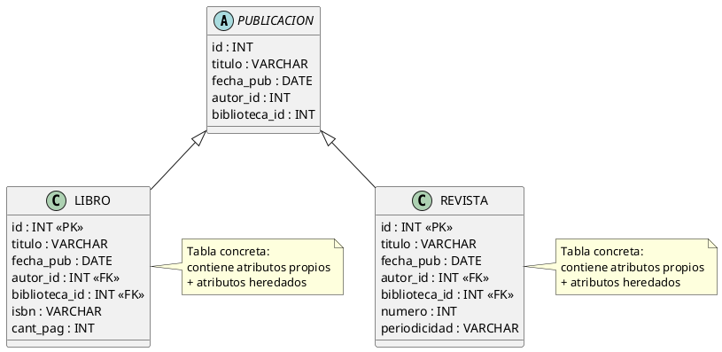

### Parte 1
- Que Clases debe ser entidades?
	- Autor
	- Revista
	- Libro
	- Biblioteca

Publicación es la clase padre que depende mucho que estrategia se use

- Que atributos pueden mapearse a columnas?
	- Todos menos los campos del enum  (y el enum)
	- List<>, almenos que se use de manera adecuada las anotaciones
- Que atributos representan las relaciones entre entidades?
	- `Biblioteca.publicaciones` es una colección de objetos de tipo `Publicacion`
	- El problema que genera `Biblioteca.publicaciones` es que la lista asi como tal no se puede persistir, sino que se se mantiene una FK en las clases hijas de Publicacion haciendo referencia a Biblioteca o por medio de una tabla intermedia, ya que es un impedance mismatch.
	- `Publicacion.autor`: Atributo que almacena la referencia al `Autor` de la publicación
- cardinalidad: 
- 
	- @OneToOne:  
	- @OneToMany: Entre `Biblioteca` y `Publicacion`
	- @ManyToOne: Publicacion hacia Biblioteca
	- @ManyToMany:

### Parte 2
- ¿Por qué necesitamos pensar cómo persistir la herencia?
Necesitamos pensar como herencia debido al impedance-mismatches  
para reutilizar el comportamiento y polimorfismo

- ¿Cuáles son las estrategias de mapeo de herencia, que se pueden utilizar?
El Single Tabla, Joined y Table per class

- Hace un diagrama aproximado de como quedan las tablas si utilizamos Single Table,Joined y Table Per Class

para single table hay una unica tabla pero ver el campo discriminador que lo llamo **dtype**:


para la estrategia de persistencia joined, esta la superclase :

 ahora para Table Per Class, que estas la tablas hijas, las tablas concretas:



### parte 3  comparaciones:


|Pregunta / Aspecto|**Single Table**|**Joined**|**Table Per Class**|
|:--|:--|:--|:--|
|**¿Dónde se almacenan los atributos comunes de `Publicacion`?**|En la tabla única `PUBLICACION`.|En la tabla base de la superclase `PUBLICACION`.|Duplicados en cada tabla concreta (`LIBRO` y `REVISTA`).|
|**¿Dónde quedan los atributos específicos de `Libro` y `Revista`?**|En la tabla única `PUBLICACION`.|En sus respectivas tablas hijas (`LIBRO` y `REVISTA`).|En sus respectivas tablas hijas (`LIBRO` y `REVISTA`).|
|**¿Hay alguna columna que pueda quedar en `NULL`? ¿Cuáles?**|**Sí, muchas.** Todas las columnas específicas de las subclases (`isbn`, `cantidad_paginas`, `numero`, `periodicidad`) deben permitir `NULL`.|**No.** Se pueden aplicar restricciones `NOT NULL` a nivel de base de datos en las columnas específicas.|**No.** Las columnas específicas pueden ser obligatorias (`NOT NULL`) en sus tablas individuales.|
|**¿Puede `Biblioteca` tener una relación directa (FK) sin conocer el subtipo?**|**Sí.** La foreign key `biblioteca_id` se coloca en `PUBLICACION`.|**Sí.** La foreign key `biblioteca_id` se coloca en la tabla superclase `PUBLICACION`.|**No de forma referencial directa estándar.** Las bases de datos relacionales no admiten que una sola FK apunte polimórficamente a múltiples tablas. Requiere tablas de unión intermedias.|
|**¿Qué debe hacer la base de datos para recuperar todas las publicaciones?**|Un `SELECT` directo y simple de una sola tabla (máxima eficiencia).|Un `SELECT` sobre `PUBLICACION` haciendo `LEFT JOIN` con `LIBRO` y `REVISTA`.|Una consulta polimórfica que realiza un `UNION` entre todas las tablas concretas.|


**la Estrategia Recomendada** dependo mucho de que quiero priorizar, difiere para cada caso

**Opción Recomendada A:** **SINGLE_TABLE** **(Priorizando el Rendimiento)**

- **Justificación:** En esta aplicación, el caso de uso central del requerimiento pide que podamos realizar de forma simple y concurrente la consulta de todas las publicaciones de una biblioteca (`biblioteca.getPublicaciones()`) para obtener indistintamente libros y revistas. Al usar **Single Table**, la base de datos resuelve esto mediante un `SELECT` sumamente simple sobre una sola tabla:

```
SELECT * FROM PUBLICACION WHERE biblioteca_id = ?
```

No requiere realizar joins pesados ni costosas uniones de tablas (`UNION ALL`). Dado que las subclases `Libro` y `Revista` tienen muy pocos atributos específicos, el "desperdicio" de espacio debido a columnas con valores `NULL` es insignificante en comparación con la ganancia masiva en la performance de consultas polimórficas.

**Opción Recomendada B:** **JOINED** **(Priorizando la Integridad de los Datos)**

- **Justificación:** Si para la organización es un requerimiento crítico garantizar la **consistencia e integridad estricta del esquema de base de datos** (por ejemplo, asegurar que un `Libro` persistido en la base de datos jamás pueda tener su campo `isbn` en `NULL`). En `SINGLE_TABLE` no podríamos forzar esta restricción a nivel DB. Con `JOINED`, el esquema relacional queda normalizado, permitiendo aplicar restricciones de integridad física completas a costa de mayor sobrecarga en las consultas de lectura polimórfica por el uso de `LEFT JOINs`.

**Estrategia Descartada:** Se descarta por completo **Table Per Class**, ya que el requerimiento explícito es consultar polimórficamente la colección de publicaciones de la biblioteca, y esta estrategia genera consultas excesivamente complejas (`UNION`) que degradan la performance y rompen las claves foráneas polimórficas nativas de la base de datos.
