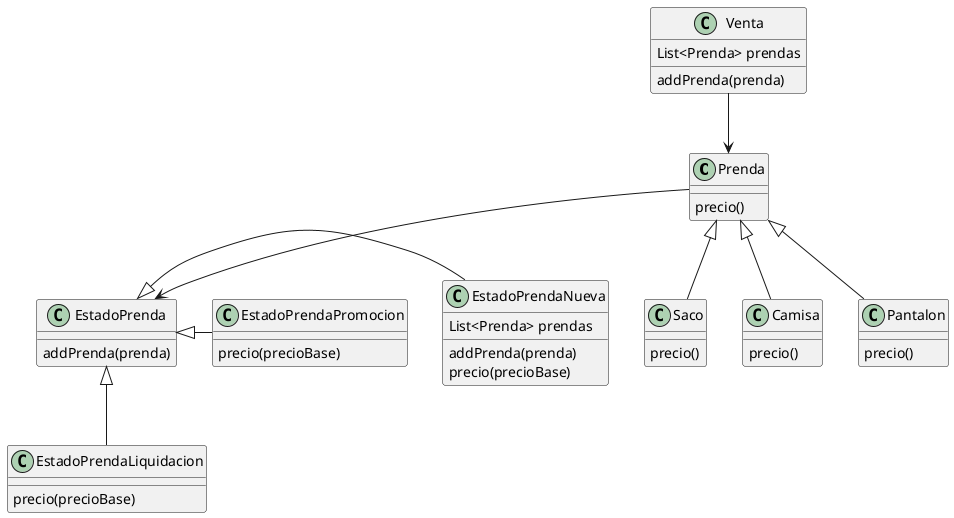
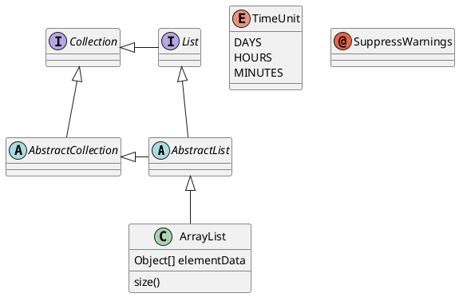
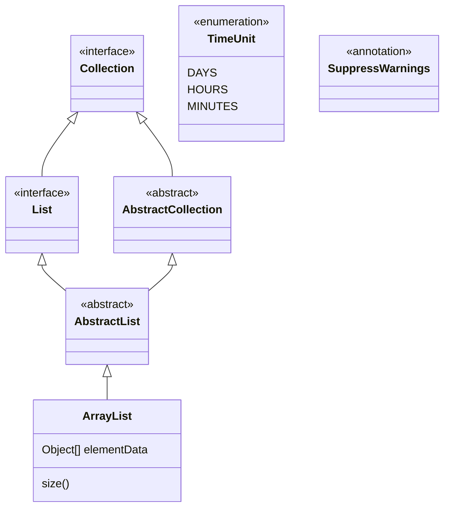
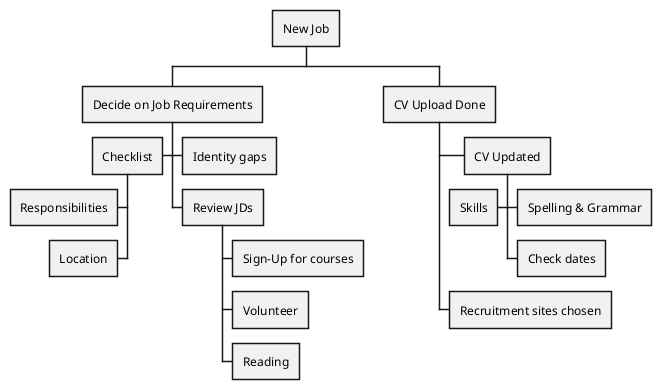

Maco Wins  
Se requiere:

- Identificar los requerimientos  
    
- Presentar una solución usando el paradigma de objetos (empleando pseudocódigo y [diagrama de clases](https://docs.google.com/document/d/1eXLlNppAX-7E2M8Xxs0MCckdn4XVEYmeQNaS_E1RqTc/edit?tab=t.0)).  
    
- Explicar todo lo que considere necesario en prosa (dentro del archivo de pseudocódigo).

La conocida empresa de ropa formal para caballeros, Macowins, es capaz de darle soporte a la venta de prendas. Un fragmento de la grabación del analista con el cliente:

“Queremos saber el precio de venta de una prenda y sus tipos, los tipos de prenda son: sacos, pantalones, camisas.”

El cálculo del precio de una prenda es, el precio propio de la prenda modificado según el estado de la prenda, que pueden ser:

- Nueva: en este caso no modifican el precio base.  
    
- Promoción: Le resta un valor fijo decidido por el usuario.  
    
- Liquidación: Es un 50% del valor del producto.

Ah, un requerimiento más: Macowins registra las ventas de estas prendas y necesita saber las ganancias de un determinado día. 

“Cada venta tiene asociada las prendas que se vendieron, su cantidad y la fecha de venta. 

Las ventas pueden ser en efectivo o con tarjeta. En el caso que sea con tarjeta, tienen el mismo comportamiento que en efectivo (el cual no modifica el precio), sólo que se le aplica un recargo según la cantidad de cuotas seleccionadas (cantidad de cuotas * un coeficiente fijo + 0.01 del valor de cada prenda).”

---

RTAs.
Requerimientos:
- Saber precio de la prenda
	- calculo de la prenda según el estado base
- Saber el tipo de prenda

```java
Prenda prenda = new Saco();
prenda.addDatos();
var _precio = prenda.precio();
```

```java
#Prenda>>precio(){
	return this.estado.precio(this.precioBase); 
}
#EstadoNueva>>precio(precioBase){
	//return this.estado.precio(this.precioBase);
	return precioBase; 
}
#EstadoPromocion>>precio(precioBase){
	return precioBase-this.usuario.getValorFijo(); 
}
#EstadoLiquidacion>>precio(precioBase){
	return precioBase*this.usuario.porcentajeDescuento; 
}
```
```java
Venta venta = new Venta();
Prenda camisa1= new Camisa(new Promocion);
venta.addPrenda(camisa1);

MetodoDePago metodo1= new MetodoDePagoTarjeta(cuotas=5);
venta.cobrar(metodo1);

venta.cantVentasDia(new Date("03/04/2026"));
```
diagrama de clases:

ejemplo:

ejemplo:

mermaid



----
para linteo rápido.
```sh
mvn clean verify && git tag entrega-final && git push origin HEAD --tags
```
```sh
mvn clean verify && git tag  TPI1-Macowins && git push origin HEAD --tags
```

```sh
mvn compile     # Auto-formatea
mvn spotless:apply  # Fuerza formato
mvn clean verify
```
```xml
<plugin>  
  <groupId>com.diffplug.spotless</groupId>  
  <artifactId>spotless-maven-plugin</artifactId>  
  <version>2.43.0</version>  
  <configuration>    <java>      <googleJavaFormat/>    </java>  </configuration></plugin>
```



