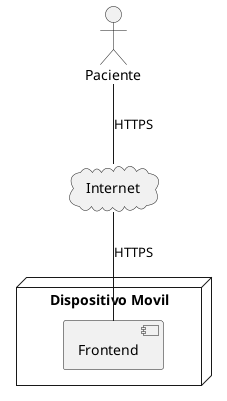

Punto 1 - Arquitectura (35 puntos)
A)
El componente cola sobra y es innecesario, innecesario por que ya se explicita que es por API REST 
Además también se aclara que ese servicio tarda en responder
Basta aclarar la comunicación (la linea que conecta) que es por HTTP
Por api rest hay mas simplicidad y envio de datos de manera simple
Por cola de mensajes hay mas complejidad en cuanto a la necesidad del Worker pero aun así no corresponde por que no se aclara por ningún lado un alto trafico de manera estricta ni sobre todo el asincronismo

tampoco por base de datos por que aun así se aclara que el servicio expone api rest

B)

algo además de api rest? 
C)
diagrama de arq:

