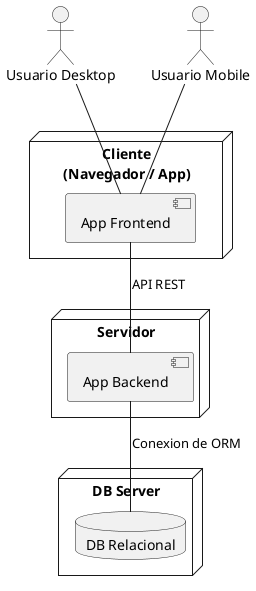
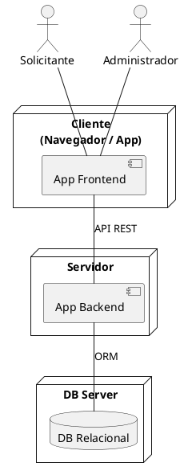

https://github.com/dds-utn/tpi2-introducci-n-a-arquitectura-pacoDan
TP:

```plantuml
@startuml
' Actores
actor "Usuario Desktop" as Desktop
actor "Usuario Mobile" as Mobile

' Nodo cliente
node "Cliente\n(Navegador / App)" as Client {
    component "App Frontend" as Frontend
}

' Nodo servidor
node "Servidor" as Server {
    component "App Backend" as Backend
}

' Base de datos como nodo
node "DB Server" as DBNode {
    database "DB Relacional" as DB
}

' Relaciones sin flecha
Desktop -- Frontend
Mobile -- Frontend

Frontend -- Backend : API REST

Backend -- DB : Conexion de ORM

@enduml
```

```plantuml
@startuml
' Actores
actor Solicitante 
actor Administrador

' Nodo cliente
node "Cliente\n(Navegador / App)" as Client {
    component "App Frontend" as Frontend
}

' Nodo servidor
node "Servidor" as Server {
    component "App Backend" as Backend
}

' Base de datos como nodo
node "DB Server" as DBNode {
    database "DB Relacional" as DB
}

' Relaciones sin flecha
Solicitante -- Frontend
Administrador -- Frontend

Frontend -- Backend : API REST

Backend -- DB : ORM

@enduml
```
