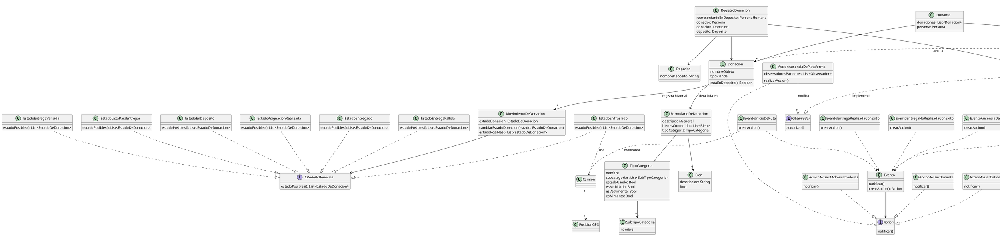

```plantuml
@startuml

' ==========================================
' INTERFACES COMUNES
' ==========================================
interface Observador {
    actualizar()
}


' ==========================================
' DONACIONES - DONANTES Y PERSONAS
' ==========================================

abstract class Persona {
}

class PersonaHumana {
	nombre
	apellido
	edad
	numeroDeDocumento
	genero
	direccion
	mediosDeContacto: List<MedioDeContacto>
}

class PersonaJuridica {
	razonSocial
	tipo: EnumTipoPersonaJuridica
	rubro
	mediosDeContacto: List<MedioDeContacto>
	representante: PersonaHumana
}

enum EnumTipoPersonaJuridica {
	Gubernamental
	ONG
	Empresa
	Institución
}

class MedioDeContacto {
	tipoMedio: String
	datoMedio: String
}

Persona <|-- PersonaHumana
Persona <|-- PersonaJuridica
Persona ..|> Observador : implementa
PersonaJuridica --> EnumTipoPersonaJuridica
PersonaJuridica --> PersonaHumana
PersonaJuridica --> "*" MedioDeContacto

class Donante {
    donaciones: List<Donacion>
    persona: Persona
}

class Donacion {
	nombreObjeto
	tipoVianda
	estaEnDeposito(): Boolean
}

Donante --> "*" Donacion
Donante --> Persona


' ==========================================
' CATEGORIZACIÓN DE DONACIONES
' ==========================================

class FormularioDeDonacion {
	descripcionGeneral
	bienesContenidos: List<Bien>
	tipoCategoria: TipoCategoria
}

class Bien {
	descripcion: String
	foto
}

class TipoCategoria {
	nombre
	subcategorias: List<SubTipoCategoria>
	estadoUsado: Bool
	esMobiliario: Bool
	esVestimenta: Bool
	esAlimento: Bool
}

class SubTipoCategoria {
	nombre
}

FormularioDeDonacion --> "*" Bien
FormularioDeDonacion --> TipoCategoria
TipoCategoria --> "*" SubTipoCategoria
Donacion --> FormularioDeDonacion : detallada en


' ==========================================
' REGISTRO Y DEPOSITOS
' ==========================================

class RegistroNuevoUsuario {
	administrador: Persona
	fecha
	hora
	datosDeRegistro: List<String>
	correoRegistro: String
	fechaAcceso
}
RegistroNuevoUsuario --> Persona

class RegistroDonacion {
	representanteEnDeposito: PersonaHumana
	donador: Persona
	donacion: Donacion
	deposito: Deposito
}
RegistroDonacion --> PersonaHumana
RegistroDonacion --> Donacion
RegistroDonacion --> Deposito

class Deposito {
	nombreDeposito: String
}


' ==========================================
' BENEFICIARIOS Y NECESIDADES
' ==========================================

class Beneficiario {
}

class EntidadBeneficiaria {
}

class NecesidadMaterial {
}

class NecesidadRecurrente {
}

class NecesidadExtraordinaria {
}

Beneficiario <|-- EntidadBeneficiaria
NecesidadMaterial <|-- NecesidadRecurrente
NecesidadMaterial <|-- NecesidadExtraordinaria
EntidadBeneficiaria "1" --> "*" NecesidadMaterial


' ==========================================
' ASIGNACIÓN DE DONACIONES (STRATEGY PATTERN)
' ==========================================

class AsignacionDeDonacion {
	asignador: AlgoritmoDeAsignacion
	beneficiarios: List<Beneficiario>
	asignarDonacion(donacion: Donacion, beneficiarios: List<Beneficiario>)
	asignarDonacion(donacion: Donacion): Beneficiario
}

interface AlgoritmoDeAsignacion {
	elegirBeneficiario(donacion: Donacion, beneficiarios: List<Beneficiario>): Beneficiario
}

class AlgoritmoCompatibilidadSemantica {
	elegirBeneficiario(donacion: Donacion, beneficiarios: List<Beneficiario>): Beneficiario
}

class AlgoritmoPrioridadSubAtendidos {
	elegirBeneficiario(donacion: Donacion, beneficiarios: List<Beneficiario>): Beneficiario
}

AlgoritmoCompatibilidadSemantica ..|> AlgoritmoDeAsignacion
AlgoritmoPrioridadSubAtendidos ..|> AlgoritmoDeAsignacion
AsignacionDeDonacion --> AlgoritmoDeAsignacion
AsignacionDeDonacion ..> Donacion : evalúa
AsignacionDeDonacion --> "*" Beneficiario


' ==========================================
' TRAZABILIDAD Y ESTADOS (STATE PATTERN)
' ==========================================

class MovimientoDeDonacion {
	estadoDonacion: EstadoDeDonacion
	cambiarEstadoDonacion(estado: EstadoDeDonacion)
	estadoPosibles(): List<EstadoDeDonacion>
}

interface EstadoDeDonacion {
	estadoPosibles(): List<EstadoDeDonacion>
}

MovimientoDeDonacion --> EstadoDeDonacion
Donacion --> "*" MovimientoDeDonacion : registra historial

class EstadoEnDeposito {
	estadoPosibles(): List<EstadoDeDonacion>
}
class EstadoAsignacionRealizada {
	estadoPosibles(): List<EstadoDeDonacion>
}
class EstadoListaParaEntregar {
	estadoPosibles(): List<EstadoDeDonacion>
}
class EstadoEnTraslado {
	estadoPosibles(): List<EstadoDeDonacion>
}
class EstadoEntregado {
	estadoPosibles(): List<EstadoDeDonacion>
}
class EstadoEntregaFallida {
	estadoPosibles(): List<EstadoDeDonacion>
}
class EstadoEntregaVencida {
	estadoPosibles(): List<EstadoDeDonacion>
}

EstadoEnDeposito ..|> EstadoDeDonacion
EstadoAsignacionRealizada ..|> EstadoDeDonacion
EstadoListaParaEntregar ..|> EstadoDeDonacion
EstadoEnTraslado ..|> EstadoDeDonacion
EstadoEntregado ..|> EstadoDeDonacion
EstadoEntregaFallida ..|> EstadoDeDonacion
EstadoEntregaVencida ..|> EstadoDeDonacion


' ==========================================
' LOGÍSTICA
' ==========================================

class Camion {
}
class PosicionGPS {
}
Camion "1" --> "*" PosicionGPS
EstadoEnTraslado ..> Camion : usa


' ==========================================
' EVENTOS Y NOTIFICACIONES
' ==========================================

class Evento {
	notificar()
	crearAccion(): Accion
}

class EventoAusenciaDePlataforma20Dias {
	crearAccion()
}
class EventoDonacionAsignadaRecibido {
	crearAccion()
}
class EventoInicioDeRuta {
	crearAccion()
}
class EventoEntregaRealizadaConExito {
	crearAccion()
}
class EventoEntregaNoRealizadaConExito {
	crearAccion()
}

EventoAusenciaDePlataforma20Dias ..> Evento
EventoDonacionAsignadaRecibido ..> Evento
EventoInicioDeRuta ..> Evento
EventoEntregaRealizadaConExito ..> Evento
EventoEntregaNoRealizadaConExito ..> Evento
EventoInicioDeRuta ..> Camion : monitorea

interface Accion {
	notificar()
}

class AccionAvisarDonante {
	notificar()
}
class AccionAvisarEntidadBeneficiada {
	notificar()
}
class AccionAvisarAAdministradores {
	notificar()
}
class AccionAusenciaDePlataforma {
	observadoresPacientes: List<Observador>
	realizarAccion()
}

Evento --> Accion
AccionAvisarDonante ..|> Accion
AccionAvisarEntidadBeneficiada ..|> Accion
AccionAvisarAAdministradores ..|> Accion
AccionAusenciaDePlataforma ..|> Accion
AccionAusenciaDePlataforma --> "*" Observador : notifica

@enduml
```