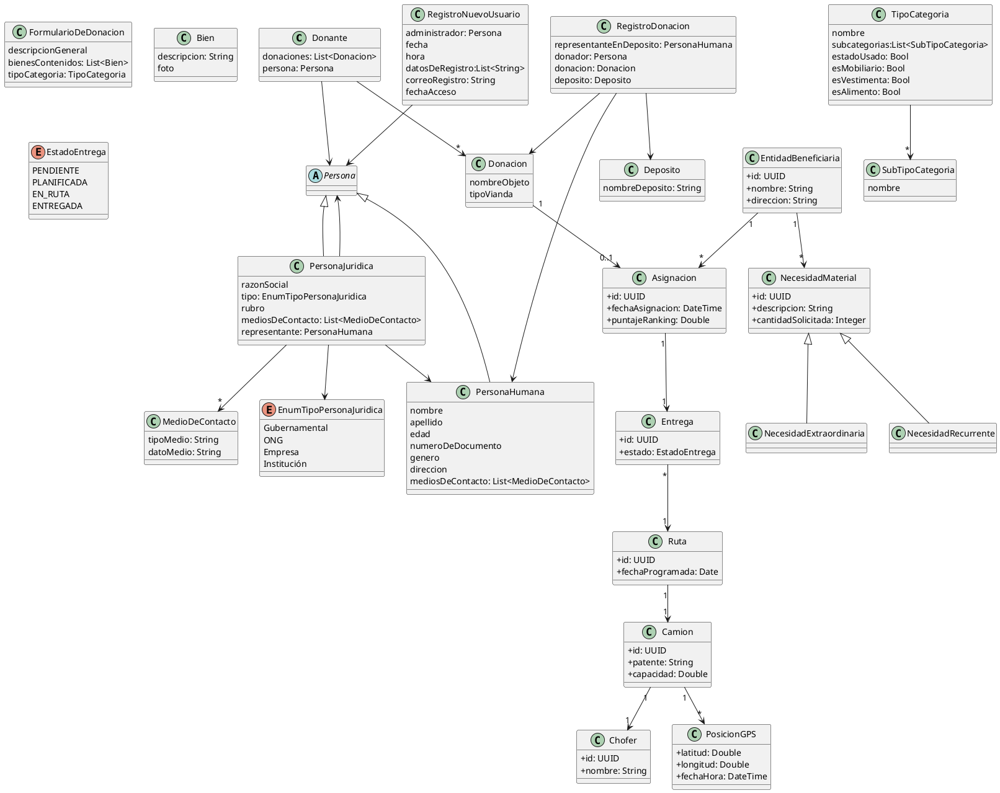

diagrama de clases:

```plantuml
@startuml
skinparam classAttributeIconSize 0

'Donaciones - Donantes
'=========================

 class Donante {
    donaciones: List<Donacion>
    persona: Persona
}
Donante --> "*" Donacion
Donante --> Persona

class Donacion{
	nombreObjeto
	tipoVianda
}

abstract class Persona{

}
class PersonaHumana{
	nombre
	apellido
	edad
	numeroDeDocumento
	genero
	direccion
	mediosDeContacto: List<MedioDeContacto>
}

Persona <|-- PersonaHumana
class MedioDeContacto{
	tipoMedio: String
	datoMedio: String
}

class PersonaJuridica{
	razonSocial
	tipo: EnumTipoPersonaJuridica
	rubro
	mediosDeContacto: List<MedioDeContacto>
	representante: PersonaHumana
}
PersonaJuridica --> EnumTipoPersonaJuridica
PersonaJuridica --> PersonaHumana
PersonaJuridica --> "*" MedioDeContacto

enum EnumTipoPersonaJuridica{
	Gubernamental
	ONG
	Empresa
	Institución
}
Persona <|-- PersonaJuridica


'Donaciones - Registro de personas donantes
'=========================
PersonaJuridica --> Persona
class RegistroNuevoUsuario{
	administrador: Persona
	fecha
	hora
	datosDeRegistro:List<String>
	correoRegistro: String
	fechaAcceso
}
RegistroNuevoUsuario --> Persona
class RegistroDonacion{
	representanteEnDeposito: PersonaHumana
	donador: Persona
	donacion: Donacion
	deposito: Deposito
}
RegistroDonacion --> PersonaHumana
RegistroDonacion --> Donacion
RegistroDonacion --> Deposito
class Deposito{
	nombreDeposito: String
}
'Entiendo que hay una persona para recibir la donacion de la persona donante

'Donaciones - Donaciones y segmentación
'==============
class FormularioDeDonacion{
	descripcionGeneral
	bienesContenidos: List<Bien>
	tipoCategoria: TipoCategoria
}
'falta las subcategorias de las categorias

class Bien{
	descripcion: String
	foto
}
class TipoCategoria{
	nombre
	subcategorias:List<SubTipoCategoria>
	estadoUsado: Bool
	esMobiliario: Bool
	esVestimenta: Bool
	esAlimento: Bool
	
}
TipoCategoria --> "*" SubTipoCategoria
class SubTipoCategoria{
	nombre
}

' BENEFICIARIOS
'=========================

class EntidadBeneficiaria {
    +id: UUID
    +nombre: String
    +direccion: String
}

class NecesidadMaterial {
    +id: UUID
    +descripcion: String
    +cantidadSolicitada: Integer
}

class NecesidadRecurrente
class NecesidadExtraordinaria

NecesidadMaterial <|-- NecesidadRecurrente
NecesidadMaterial <|-- NecesidadExtraordinaria

EntidadBeneficiaria "1" --> "*" NecesidadMaterial

'=========================
' ASIGNACION
'=========================

class Asignacion {
    +id: UUID
    +fechaAsignacion: DateTime
    +puntajeRanking: Double
}

Donacion "1" --> "0..1" Asignacion
EntidadBeneficiaria "1" --> "*" Asignacion

'=========================
' LOGISTICA
'=========================

class Entrega {
    +id: UUID
    +estado: EstadoEntrega
}

enum EstadoEntrega {
    PENDIENTE
    PLANIFICADA
    EN_RUTA
    ENTREGADA
}

class Ruta {
    +id: UUID
    +fechaProgramada: Date
}

class Camion {
    +id: UUID
    +patente: String
    +capacidad: Double
}

class Chofer {
    +id: UUID
    +nombre: String
}

Asignacion "1" --> "1" Entrega

Entrega "*" --> "1" Ruta
Ruta "1" --> "1" Camion
Camion "1" --> "1" Chofer

class PosicionGPS {
    +latitud: Double
    +longitud: Double
    +fechaHora: DateTime
}

Camion "1" --> "*" PosicionGPS

@enduml
```

