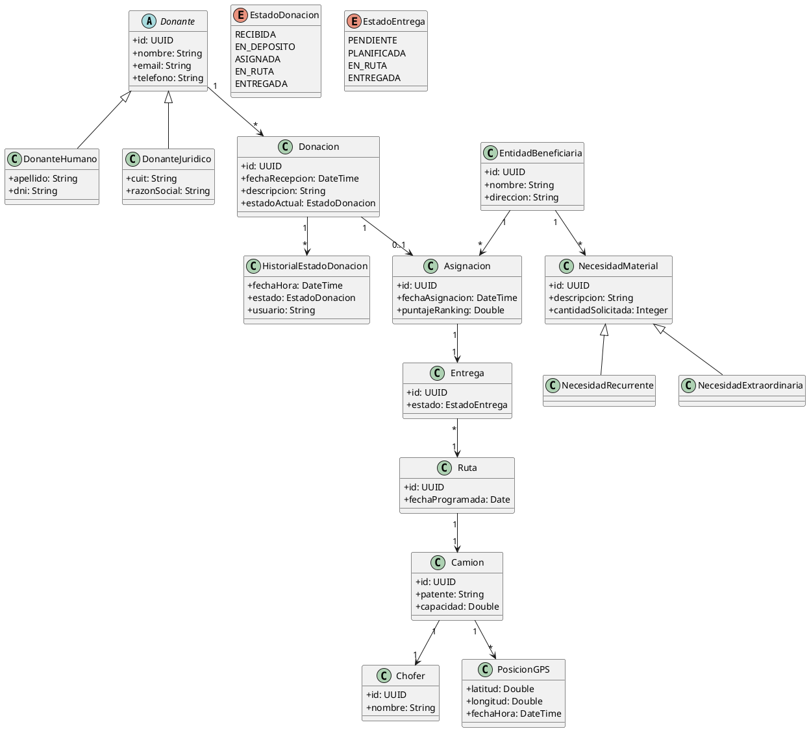

diagrama de clases:

```plantuml
@startuml
skinparam classAttributeIconSize 0

'=========================
' DONANTES
'=========================

abstract class Donante {
    +id: UUID
    +nombre: String
    +email: String
    +telefono: String
}

class DonanteHumano {
    +apellido: String
    +dni: String
}

class DonanteJuridico {
    +cuit: String
    +razonSocial: String
}

Donante <|-- DonanteHumano
Donante <|-- DonanteJuridico

'=========================
' DONACIONES
'=========================

class Donacion {
    +id: UUID
    +fechaRecepcion: DateTime
    +descripcion: String
    +estadoActual: EstadoDonacion
}

class HistorialEstadoDonacion {
    +fechaHora: DateTime
    +estado: EstadoDonacion
    +usuario: String
}

enum EstadoDonacion {
    RECIBIDA
    EN_DEPOSITO
    ASIGNADA
    EN_RUTA
    ENTREGADA
}

Donante "1" --> "*" Donacion
Donacion "1" --> "*" HistorialEstadoDonacion

'=========================
' BENEFICIARIOS
'=========================

class EntidadBeneficiaria {
    +id: UUID
    +nombre: String
    +direccion: String
}

class NecesidadMaterial {
    +id: UUID
    +descripcion: String
    +cantidadSolicitada: Integer
}

class NecesidadRecurrente
class NecesidadExtraordinaria

NecesidadMaterial <|-- NecesidadRecurrente
NecesidadMaterial <|-- NecesidadExtraordinaria

EntidadBeneficiaria "1" --> "*" NecesidadMaterial

'=========================
' ASIGNACION
'=========================

class Asignacion {
    +id: UUID
    +fechaAsignacion: DateTime
    +puntajeRanking: Double
}

Donacion "1" --> "0..1" Asignacion
EntidadBeneficiaria "1" --> "*" Asignacion

'=========================
' LOGISTICA
'=========================

class Entrega {
    +id: UUID
    +estado: EstadoEntrega
}

enum EstadoEntrega {
    PENDIENTE
    PLANIFICADA
    EN_RUTA
    ENTREGADA
}

class Ruta {
    +id: UUID
    +fechaProgramada: Date
}

class Camion {
    +id: UUID
    +patente: String
    +capacidad: Double
}

class Chofer {
    +id: UUID
    +nombre: String
}

Asignacion "1" --> "1" Entrega

Entrega "*" --> "1" Ruta
Ruta "1" --> "1" Camion
Camion "1" --> "1" Chofer

class PosicionGPS {
    +latitud: Double
    +longitud: Double
    +fechaHora: DateTime
}

Camion "1" --> "*" PosicionGPS

@enduml
```

