diagrama de clases:

```plantuml
@startuml

'Donaciones - Donantes
'=========================

class Donante {
    donaciones: List<Donacion>
    persona: Persona
}
Donante --> "*" Donacion
Donante --> Persona

class Donacion{
	nombreObjeto
	tipoVianda
}

abstract class Persona{

}
class PersonaHumana{
	nombre
	apellido
	edad
	numeroDeDocumento
	genero
	direccion
	mediosDeContacto: List<MedioDeContacto>
}

Persona <|-- PersonaHumana
class MedioDeContacto{
	tipoMedio: String
	datoMedio: String
}

class PersonaJuridica{
	razonSocial
	tipo: EnumTipoPersonaJuridica
	rubro
	mediosDeContacto: List<MedioDeContacto>
	representante: PersonaHumana
}
PersonaJuridica --> EnumTipoPersonaJuridica
PersonaJuridica --> PersonaHumana
PersonaJuridica --> "*" MedioDeContacto

enum EnumTipoPersonaJuridica{
	Gubernamental
	ONG
	Empresa
	Institución
}
Persona <|-- PersonaJuridica


'Donaciones - Registro de personas donantes
'=========================
PersonaJuridica --> Persona
class RegistroNuevoUsuario{
	administrador: Persona
	fecha
	hora
	datosDeRegistro:List<String>
	correoRegistro: String
	fechaAcceso
}
RegistroNuevoUsuario --> Persona
class RegistroDonacion{
	representanteEnDeposito: PersonaHumana
	donador: Persona
	donacion: Donacion
	deposito: Deposito
}
RegistroDonacion --> PersonaHumana
RegistroDonacion --> Donacion
RegistroDonacion --> Deposito
class Deposito{
	nombreDeposito: String
}
'Entiendo que hay una persona para recibir la donacion de la persona donante

'Donaciones - Donaciones y segmentación
'==============
class FormularioDeDonacion{
	descripcionGeneral
	bienesContenidos: List<Bien>
	tipoCategoria: TipoCategoria
}
'falta las subcategorias de las categorias

class Bien{
	descripcion: String
	foto
}
class TipoCategoria{
	nombre
	subcategorias:List<SubTipoCategoria>
	estadoUsado: Bool
	esMobiliario: Bool
	esVestimenta: Bool
	esAlimento: Bool
	
}
TipoCategoria --> "*" SubTipoCategoria
class SubTipoCategoria{
	nombre
}

' BENEFICIARIOS
'=========================


class NecesidadRecurrente
class NecesidadExtraordinaria

NecesidadMaterial <|-- NecesidadRecurrente
NecesidadMaterial <|-- NecesidadExtraordinaria

EntidadBeneficiaria "1" --> "*" NecesidadMaterial


Camion "1" --> "*" PosicionGPS

'OK
'------------------
'eventos y sus notificaciones
class Evento{
	notificar()
	crearAccion(): Accion
}
class EventoAusenciaDePlataforma20Dias{
	crearAccion()
}
'avisa a donante y a entidad beneficiada
class EventoDonacionAsignadaRecibido{
	crearAccion()
}
'a todas las beneficiarias de la reparticion, y sus donantes, con mapa interactivo
class EventoInicioDeRuta{
	crearAccion()
}
'espera ACK de recibido, se avisa a donante, entidad, dar comprobante de entrega, sus datos y datos del camion
class EventoEntregaRealizadaConExito{
	crearAccion()
}
'notifcar entidad, doante, administradores de sistema, SE REPLANIFICA, generar nueva asignacion
class EventoEntregaNoRealizadaConExito{
	crearAccion()
}
EventoAusenciaDePlataforma20Dias ..> Evento
EventoDonacionAsignadaRecibido ..> Evento
EventoInicioDeRuta ..> Evento
EventoEntregaRealizadaConExito ..> Evento
EventoEntregaNoRealizadaConExito ..> Evento

interface Accion{
	notificar()
}
class AccionAvisarDonante{
	notificar()
}
class AccionAvisarEntidadBeneficiada{
	notificar()
}
class AccionAvisarAAdministradores{
	notificar()
}
Evento --> Accion
AccionAvisarDonante ..> Accion
AccionAvisarEntidadBeneficiada ..> Accion
AccionAvisarAAdministradores ..> Accion

@enduml
```

ok asignación de donaciones:
```cpp
#AsignacionDeDonacion>> Beneficiacio asignarDonacion(Donacion donacion){
	if(donacion.estaEnDeposito()){
		return this.algoritmoDeAsignacion.elegirBeneficiario(donacion, this.beneficiarios);
	}
	else lanzarExcepcion
}
```
notificaciones:
```cpp
#AccionAusenciaDePlataforma>>realizarAccion(){
	this.observadoresPacientes.notificar();
}
```


trazabilidad de estados:
```plantuml
class MovimiendoDeDonacion{
	estadoDonacion: EstadoDeDonacion
	cambiarEstadoDonacion(EstadoDeDonacion donacion)
	'accionPosible: Accion
	'accionePosibles: List<Accion>
	estadoPosibles(): List<EstadoDeDonacion>
}
interface EstadoDeDonacion{
	estadoPosibles(): List<EstadoDeDonacion>
}
MovimiendoDeDonacion --> EstadoDeDonacion

class EstadoEnDeposito{
	estadoPosibles(): List<EstadoDeDonacion>
}
class EstadoAsignacionRealizada{
	estadoPosibles(): List<EstadoDeDonacion>
}
class EstadoListaParaEntregar{
	estadoPosibles(): List<EstadoDeDonacion>
}
class EstadoEnTraslado{
	estadoPosibles(): List<EstadoDeDonacion>
}
class EstadoEntregado{
	estadoPosibles(): List<EstadoDeDonacion>
}
class EstadoEntregaFallida{
	estadoPosibles(): List<EstadoDeDonacion>
}
class EstadoEntregaVencida{
	estadoPosibles(): List<EstadoDeDonacion>
}
EstadoEnDeposito ..|> EstadoDeDonacion
EstadoAsignacionRealizada ..|> EstadoDeDonacion
EstadoListaParaEntregar ..|> EstadoDeDonacion
EstadoEntregado ..|> EstadoDeDonacion
EstadoEntregaFallida ..|> EstadoDeDonacion
EstadoEntregaVencida ..|> EstadoDeDonacion
EstadoEnTraslado ..|> EstadoDeDonacion

```


asignacion de donaciones:
```plantuml
'OK
'------------
'asignacion de donaciones

class AsignacionDeDonacion{
	asignador: AlgoritmoDeAsignacion
	beneficiarios: List<Beneficiario>
	asignarDonacion(Donacion, List<Beneficiario>))
	asignarDonacion(Donacion)
}
interface AlgoritmoDeAsignacion{
	Beneficiario elegirBeneficiario(Donacion, List<Beneficiario>)
}
class AlgoritmoCompatibilidadSemantica{
	Beneficiario elegirBeneficiario(Donacion, List<Beneficiario>)
}
class AlgoritmoPrioridadSubAtendidos{
	Beneficiario elegirBeneficiario(Donacion, List<Beneficiario>)
}
AlgoritmoCompatibilidadSemantica ..|> AlgoritmoDeAsignacion
AlgoritmoPrioridadSubAtendidos ..|> AlgoritmoDeAsignacion
AsignacionDeDonacion --> AlgoritmoDeAsignacion

```