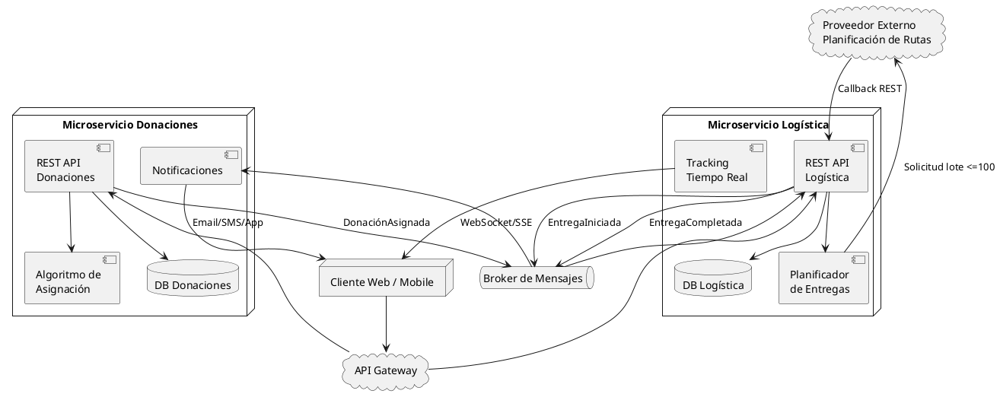

diagrama de arq:

```plantuml
@startuml

node "Cliente Web / Mobile" as Cliente

cloud "API Gateway" as Gateway

node "Microservicio Donaciones" as Donaciones {

    component "REST API\nDonaciones" as DonacionesAPI

    component "Algoritmo de\nAsignación" as Asignador

    component "Notificaciones" as Notificador

    database "DB Donaciones" as DBDonaciones
}

node "Microservicio Logística" as Logistica {

    component "REST API\nLogística" as LogisticaAPI

    component "Planificador\nde Entregas" as Planificador

    component "Tracking\nTiempo Real" as Tracking

    database "DB Logística" as DBLogistica
}

queue "Broker de Mensajes" as Broker

cloud "Proveedor Externo\nPlanificación de Rutas" as Externo

Cliente --> Gateway

Gateway --> DonacionesAPI
Gateway --> LogisticaAPI

DonacionesAPI --> DBDonaciones
LogisticaAPI --> DBLogistica

DonacionesAPI --> Broker : DonaciónAsignada
Broker --> LogisticaAPI

DonacionesAPI --> Asignador

LogisticaAPI --> Planificador

Planificador --> Externo : Solicitud lote <=100

Externo --> LogisticaAPI : Callback REST

Tracking --> Cliente : WebSocket/SSE

LogisticaAPI --> Broker : EntregaIniciada
LogisticaAPI --> Broker : EntregaCompletada

Broker --> Notificador

Notificador --> Cliente : Email/SMS/App

@enduml
```