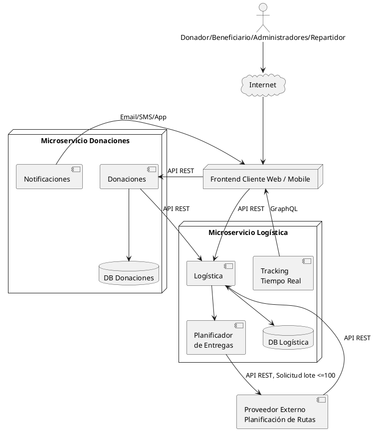

diagrama de Arq.:

los algoritmos van donde **Logística**, de alguna manera se hara con un crontask/ de manera periódica ese proceso, pero a la vez hay que recibir las donaciones pero partiendo de las que estan en deposito, no desde cuando el usuario las elige donar.. solo desde cuando estan en reposo en deposito