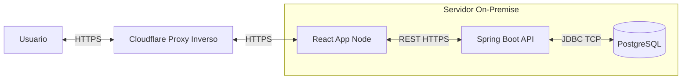
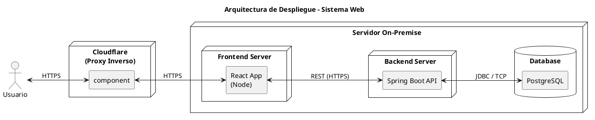

mermaid

```mermaid
flowchart LR
    U[Usuario]
    C[Cloudflare Proxy Inverso]
    R[React App Node]
    B[Spring Boot API]
    P[(PostgreSQL)]

    subgraph OP["Servidor On-Premise"]
        R
        B
        P
    end

    U <-->|HTTPS| C
    C <-->|HTTPS| R
    R <-->|REST HTTPS| B
    B <-->|JDBC TCP| P
```

plantUML:

```plantuml
@startuml
title Arquitectura de Despliegue - Sistema Web
left to right direction
skinparam componentStyle rectangle

actor Usuario as U

node "Cloudflare\n(Proxy Inverso)" as CF {
  component "component" as C
}

node "Servidor On-Premise" as OP {
  node "Frontend Server" as FE {
    component "React App\n(Node)" as R
  }

  node "Backend Server" as BE {
    component "Spring Boot API" as B
  }

  database "Database" as DB {
    component "PostgreSQL" as P
  }
}

U <--> C : HTTPS
C <--> R : HTTPS
R <--> B : REST (HTTPS)
B <--> P : JDBC / TCP

@enduml
```