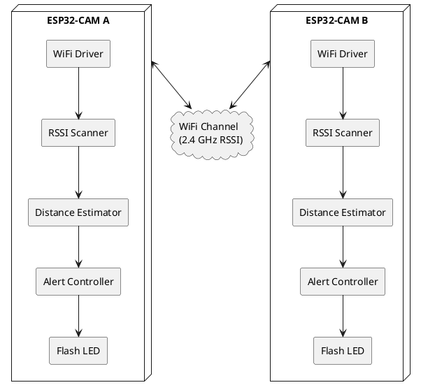

Un enfoque adecuado para este sistema es tratarlo como un sistema de **proximidad inalámbrica basada en RSSI Wi-Fi** (Received Signal Strength Indicator), donde cada ESP32-CAM mide la intensidad de señal del otro ESP32 para estimar distancia aproximada.

Como no buscás precisión centimétrica sino una detección aproximada (“más de 2 metros”), el RSSI es suficiente y evita agregar sensores ultrasónicos, ToF o BLE externos.

## Arquitectura general


## Componentes del sistema

### Nodo A — ESP32-CAM

- Modo Wi-Fi STA/AP o ESP-NOW
    
- Emite beacon o paquetes periódicos
    
- Mide RSSI recibido del Nodo B
    
- Calcula distancia aproximada
    
- Enciende LED si supera umbral
    

### Nodo B — ESP32-CAM

- Igual comportamiento que Nodo A
    
- Ambos nodos son simétricos
    

### Canal inalámbrico Wi-Fi

- Utiliza:
    
    - RSSI
        
    - potencia de señal
        
    - pérdida por propagación
        

### Lógica de proximidad

Convierte RSSI → distancia aproximada mediante modelo de propagación.

Ejemplo típico:

- −40 dBm → muy cerca
    
- −55 dBm → ~1 metro
    
- −65 dBm → ~2 metros
    
- −75 dBm → lejos
    

Esto depende muchísimo de:

- paredes
    
- orientación
    
- interferencia
    
- antena
    
- rebotes
    

Pero para “se alejó demasiado” funciona bastante bien.

---

# Diagrama de Arquitectura (PlantUML)



---

# Flujo lógico

## 1. Beacon Wi-Fi

Cada ESP32:

- transmite paquetes periódicos
    
- o mantiene conexión Wi-Fi activa
    

---

## 2. Medición RSSI

El ESP32 obtiene algo similar a:

```c
WiFi.RSSI()
```

o scan:

```c
WiFi.scanNetworks()
```

similar a:

```bash
nmcli dev wifi list
```

---

## 3. Estimación de distancia

Modelo simplificado:

d = 10^{\frac{(A - RSSI)}{10n}}

Donde:

- `d` = distancia aproximada
    
- `A` = RSSI a 1 metro
    
- `n` = factor ambiental (2 a 4)
    
- `RSSI` = señal medida
    

Ejemplo:

- RSSI = −67 dBm
    
- Resultado ≈ 2 metros
    

---

## 4. Umbral

```text
SI distancia > 2 m
    encender LED
SINO
    apagar LED
```

---

# Arquitectura de comunicación recomendada

## Opción 1 — Wi-Fi STA/AP

Un ESP32:

- Access Point
    

Otro:

- Station
    

Ventajas:

- simple
    
- estable
    
- RSSI directo
    

Desventajas:

- más consumo
    

---

## Opción 2 — ESP-NOW (RECOMENDADO)


ESP-NOW:

- peer-to-peer
    
- ultra liviano
    
- baja latencia
    
- no necesita router
    
- ideal para proximidad
    

Además:

- permite obtener RSSI de paquetes recibidos
    
- menor consumo
    
- más robusto para este caso
    

---

# Arquitectura recomendada final

```text
ESP32-CAM A
   |
   |  ESP-NOW packets
   |
ESP32-CAM B

Ambos:
- envían heartbeat
- leen RSSI
- calculan distancia
- activan LED si > 2m
```

---

# Consideraciones reales importantes

## El RSSI NO es preciso

La distancia fluctúa bastante:

- cuerpo humano
    
- orientación
    
- paredes
    
- interferencia
    

Por eso conviene:

- usar promedio móvil
    
- aplicar filtro
    

Ejemplo:

```text
RSSI promedio = últimos 10 valores
```

---

# Mejora recomendada

## Histéresis

Evita que el LED parpadee.

Ejemplo:

```text
Encender LED  -> > 2.2 m
Apagar LED    -> < 1.8 m
```

---

# Arquitectura interna recomendada del firmware

```text
Task 1:
  enviar heartbeat

Task 2:
  leer RSSI

Task 3:
  calcular distancia

Task 4:
  controlar LED
```

Usando:

- FreeRTOS del ESP32
    
- tareas concurrentes
    

---

# Tecnologías recomendadas

- ESP-IDF o Arduino Framework
    
- ESP-NOW
    
- FreeRTOS
    
- RSSI Wi-Fi
    
- Filtro EMA o Moving Average
    

---

# Nivel de precisión esperado

|Entorno|Precisión aproximada|
|---|---|
|Abierto|±1 metro|
|Interior|±2 a 4 metros|
|Con obstáculos|muy variable|

Para:

- alarma de alejamiento
    
- proximidad
    
- anti pérdida
    

es completamente viable.