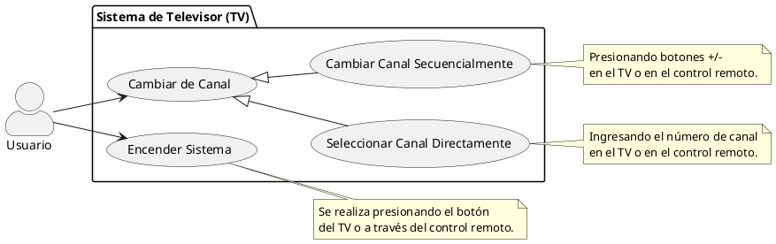

**Sí, los casos de uso se modelan y centran en los requerimientos funcionales.**

La razón de esto radica en la definición y el propósito de cada concepto:

- **Requerimientos Funcionales y Casos de Uso ("El Qué"):** Los requerimientos funcionales definen **qué es lo que el usuario quiere resolver** con el sistema o el software. Precisamente, la herramienta de **casos de uso** se utiliza para modelar y pensar en ese **"qué"**, representando la ejecución de una función específica requerida por un actor.
- **Requerimientos No Funcionales ("El Cómo" / Restricciones):** En cambio, los requerimientos no funcionales determinan **bajo qué condiciones** deben operar los requerimientos funcionales. Estos requerimientos **restringen la forma en que se pueden implementar las funciones**, aplicando pautas de operatividad, calidad, mantenibilidad o límites tecnológicos.

Por lo tanto, como un caso de uso representa la ejecución de una función del sistema, no se modelan requerimientos no funcionales (como el soporte para sonido surround, las normas de red o la resolución de pantalla del ejemplo anterior) como casos de uso independientes. Esos atributos de calidad y restricciones tecnológicas actúan por detrás, limitando o condicionando el diseño de las funciones del sistema.

### **1. Clasificación de Requerimientos**

|ID|Declaración|Tipo|Justificación|
|:--|:--|:-:|:--|
|**1**|El usuario podrá encender el sistema...|**RF**|Define una acción directa del usuario sobre el sistema (función básica).|
|**2**|El usuario podrá cambiar de canal...|**RF**|Define una interacción que altera el estado del sistema.|
|**3**|El usuario podrá seleccionar cualquier canal...|**RF**|Define una interacción específica de selección.|
|**a**|El televisor acepta resoluciones 4K y 1080p.|**RNF**|Restricción técnica de calidad/interfaz visual. No es un caso de uso.|
|**4**|Conexión a sistema de sonido Surround.|**RNF**|Interfaz externa / Compatibilidad de hardware.|
|**5**|Conectores a antena digital (TDA) y WiFi.|**RNF**|Restricción de hardware e interfaces físicas de conexión.|
|**6**|Salida de audio-video para grabación.|**RNF**|Interfaz de hardware externa.|
|**7**|Superar las 10.000 horas de uso.|**RNF**|Atributo de calidad (Confiabilidad / Mantenibilidad).|
|**8**|Estar en el mercado para el año 2019.|**Restricción**|Restricción de negocio / Temporal.|
|**9**|Respetar Derechos de Propiedad Intelectual.|**RNF / Restricción**|Restricción legal / Cumplimiento normativo.|
|**10**|Cumplir normas de redes inalámbricas.|**RNF**|Estándar regulatorio de cumplimiento obligatorio.|

---

### **2. Respuestas a las Preguntas Guía**

- **¿Qué actores intervienen?** El actor principal es el **`Usuario`**, que representa a cualquier persona que interactúa físicamente con el televisor o mediante el control remoto. Aunque los requerimientos mencionan sistemas externos (como el _Sistema de Sonido Surround_ o el _Sistema de Grabación_), en este nivel de abstracción actúan como interfaces pasivas o de salida de datos, por lo que no es estrictamente necesario modelarlos como actores activos en el diagrama de casos de uso.
    
- **¿Es posible establecer una generalización para dichos actores?** Se podría plantear una especialización del actor `Usuario` en `Usuario con Control Remoto` y `Usuario en Televisor`. Sin embargo, dado que **ambos perfiles pueden realizar exactamente las mismas acciones** (encender, cambiar y seleccionar canales), sus asociaciones con los casos de uso serían idénticas. Por **criterio de simplicidad y abstracción**, es mejor modelar un único actor general llamado **`Usuario`**.
    
- **¿Cuáles son las funcionalidades básicas que aparecen?**
    
    - **`Encender Sistema`** (RF 1)
    - **`Cambiar de Canal`** (RF 2)
- **¿Cuáles son las funcionalidades derivadas o especializaciones que surgen de las funcionalidades básicas?** La acción de seleccionar un canal específico (RF 3) es una forma especializada de cambiar de canal. Por lo tanto, podemos definir **`Cambiar de Canal`** como un caso de uso general y especializarlo mediante **herencia (generalización de casos de uso)** en:
    
    - **`Cambiar Canal Secuencialmente`** (RF 2 - usando botones +/-).
    - **`Seleccionar Canal Directamente`** (RF 3 - introduciendo un número de canal o eligiendo de una lista).
- **¿Qué Casos de Uso pueden ser incluidos en otros casos de uso?** Podría pensarse que cambiar de canal requiere que el sistema esté encendido, sugiriendo un `<<include>>` hacia `Encender Sistema`. **Esto es un error conceptual común en exámenes.** Estar encendido es una **precondición** del sistema para que el usuario pueda cambiar de canal, no una funcionalidad que se ejecuta obligatoriamente _cada vez_ que se cambia de canal. Por lo tanto, **no hay relaciones de inclusión (`<<include>>`)** necesarias en este modelo básico.
    

diagrama: 
